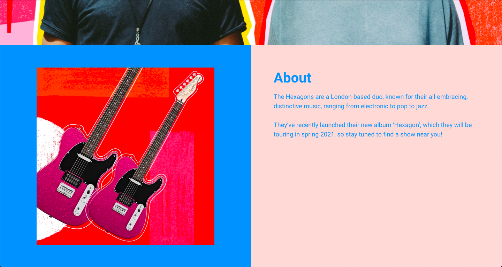
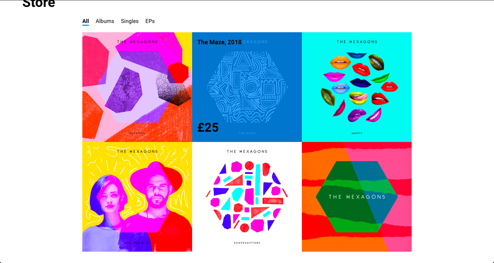
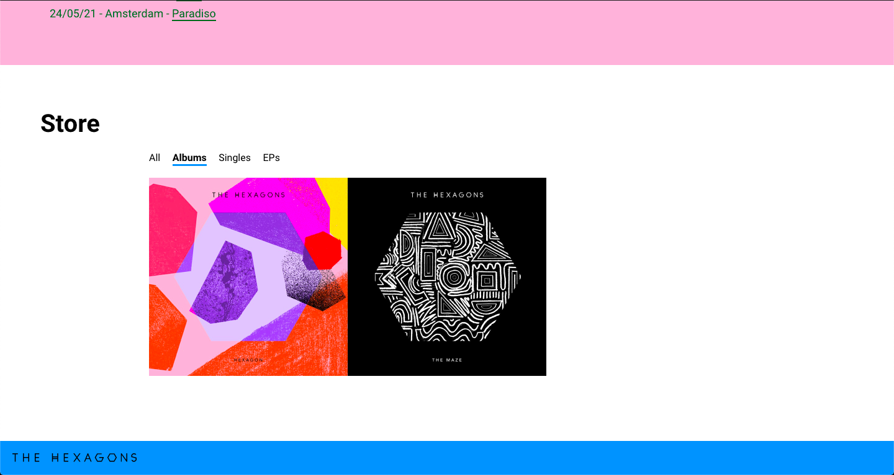

# The Hexagons
Site for band The Hexagons, using jQuery filters.

## Table of contents
* [General info](#general-info)
* [Screenshots](#screenshots)
* [Technologies](#technologies)
* [Demo](#demo)
* [Features](#features)
* [Status](#status)
* [Inspiration](#inspiration)
* [Contact](#contact)

## General info
This was the fifth homework project on the [Superhi Foundation](https://superhi.com/courses/html-css-javascript-foundation) course. It is a redesign of the main project for the week, [Essmei](https://github.com/guybroadhurst/essmei)Bulding on the techiques from last week, this utilises hover overlays to reveal additional information about the products. And then uses javascript to filter the number of products by product type. 

## Screenshots

## Technologies
* HTML5
* CSS3
* jQuery v3.5.1

## Demo
[Live Demo](https://guybroadhurst.github.io/the-hexagons/)

## Features
List of features:
* Filters on the products using jQuery.
* Nice hover overlay with product name and price. 
* Flexible layout using CSS flexbox.

## Status
Project is: _finished_ and complete for the course.

## Inspiration
Designed by Meara Withe, [Website](http://www.mearawithe.co/) [Twitter](https://twitter.com/mearawithe)
 
## Contact
Created by [@guybroadhurst](https://www.guybroadhurst.co.uk/) - feel free to contact me!
